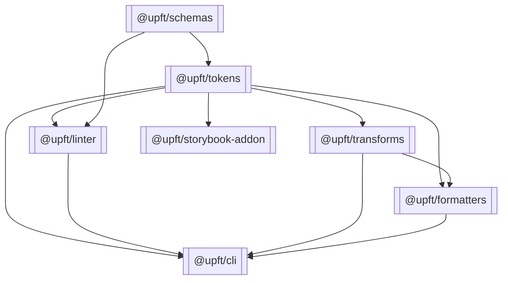

# Monorepo Architecture

## Overview

Transform UPFT from a single package into a well-structured monorepo, enabling modular development, independent versioning, and clear separation of concerns. This foundational architecture supports the entire roadmap implementation.

## Package Structure

```
upft/
├── packages/
│   ├── tokens/          # Core token processing (@upft/tokens)
│   ├── schemas/         # JSON schemas (@upft/schemas)
│   ├── transforms/      # Transform system (@upft/transforms)
│   ├── formatters/      # Output formatters (@upft/formatters)
│   ├── linter/          # Linting rules (@upft/linter)
│   └── storybook-addon/ # Storybook addon (@upft/storybook-addon)
├── apps/
│   └── cli/             # CLI tool (@upft/cli)
├── examples/            # Example projects
├── docs/               # Documentation
├── scripts/            # Build scripts
├── package.json        # Root workspace
├── pnpm-workspace.yaml # PNPM workspace config
└── biome.json         # Shared linting/formatting
```

## Package Responsibilities

### @upft/schemas
- **Purpose**: JSON schemas for DTCG tokens and manifests
- **Dependencies**: None (pure schemas)
- **Exports**: Schema files, validation schemas
- **Version**: Independent, follows schema changes

### @upft/tokens
- **Purpose**: Core token processing engine
- **Dependencies**: @upft/schemas
- **Exports**: Token operations, AST, merging, references
- **Contains**: Current core/, ast/, references/, validation/

### @upft/cli
- **Purpose**: Command-line interface
- **Dependencies**: @upft/tokens, @upft/linter, @upft/transforms, @upft/formatters
- **Exports**: CLI commands
- **Binary**: `upft` command

### @upft/linter
- **Purpose**: Token and manifest linting
- **Dependencies**: @upft/tokens, @upft/schemas
- **Exports**: Lint rules, rule runner
- **Contains**: Current linter/ module

### @upft/transforms (Future)
- **Purpose**: Value, name, and attribute transformations
- **Dependencies**: @upft/tokens
- **Exports**: Transform registry, built-in transforms
- **Phase**: Week 1-2 of roadmap

### @upft/formatters (Future)
- **Purpose**: Output format generators
- **Dependencies**: @upft/tokens, @upft/transforms
- **Exports**: CSS, SCSS, iOS, Android formatters
- **Phase**: Week 2-3 of roadmap

### @upft/storybook-addon (Future)
- **Purpose**: Storybook integration for token documentation
- **Dependencies**: @upft/tokens
- **Exports**: React components, Storybook decorators
- **Phase**: Week 5-6 of roadmap

## Dependency Graph



## Migration Plan

### Phase 1: Workspace Setup

#### 1. Initialize PNPM Workspace

```bash
# Install pnpm globally
npm install -g pnpm

# Create workspace configuration
cat > pnpm-workspace.yaml << EOF
packages:
  - "packages/*"
  - "examples/*"
EOF

# Convert to pnpm
rm -rf node_modules package-lock.json
pnpm install
```

#### 2. Update Root package.json

```json
{
  "name": "upft",
  "private": true,
  "type": "module",
  "engines": {
    "node": ">=22.6.0",
    "pnpm": ">=8.0.0"
  },
  "scripts": {
    "build": "pnpm -r build",
    "test": "pnpm -r test",
    "lint": "biome check --write .",
    "typecheck": "pnpm -r typecheck",
    "clean": "pnpm -r clean",
    "dev": "pnpm -r --parallel dev",
    "release": "changeset publish",
    "version": "changeset version"
  },
  "devDependencies": {
    "@biomejs/biome": "^2.1.4",
    "@changesets/cli": "^2.27.1",
    "@types/node": "^24.2.1",
    "typescript": "^5.9.2",
    "vitest": "^3.2.4"
  }
}
```

### Phase 2: Package Creation

#### 3. Create @upft/schemas

```bash
mkdir -p packages/schemas/src
mv src/schemas/* packages/schemas/src/
```

**packages/schemas/package.json:**
```json
{
  "name": "@upft/schemas",
  "version": "0.5.0",
  "type": "module",
  "description": "JSON schemas for DTCG design tokens",
  "main": "./src/index.js",
  "exports": {
    ".": "./src/index.js",
    "./tokens/*": "./src/tokens/*",
    "./manifest": "./src/manifest.schema.json"
  },
  "files": ["src"],
  "publishConfig": {
    "access": "public"
  }
}
```

#### 4. Create @upft/linter

```bash
mkdir -p packages/linter/src
mv src/linter/* packages/linter/src/
```

**packages/linter/package.json:**
```json
{
  "name": "@upft/linter",
  "version": "0.5.0",
  "type": "module",
  "main": "./dist/index.js",
  "types": "./dist/index.d.ts",
  "dependencies": {
    "@upft/schemas": "workspace:*",
    "@upft/tokens": "workspace:*",
    "picocolors": "^1.1.1"
  },
  "scripts": {
    "build": "tsc -p tsconfig.build.json",
    "test": "vitest run",
    "typecheck": "tsc --noEmit"
  }
}
```

#### 5. Create @upft/cli

```bash
mkdir -p apps/cli/src
mv src/cli/* apps/cli/src/
```

**apps/cli/package.json:**
```json
{
  "name": "@upft/cli",
  "version": "0.5.0",
  "type": "module",
  "bin": {
    "upft": "./dist/cli.js"
  },
  "dependencies": {
    "@upft/tokens": "workspace:*",
    "@upft/linter": "workspace:*",
    "commander": "^14.0.0",
    "picocolors": "^1.1.1",
    "chokidar": "^4.0.3"
  },
  "scripts": {
    "build": "tsc -p tsconfig.build.json && chmod +x dist/cli.js",
    "dev": "tsx watch src/cli.ts"
  }
}
```

#### 6. Update @upft/tokens

```bash
mkdir -p packages/tokens/src
mv src/* packages/tokens/src/ 2>/dev/null || true
mv package.json packages/tokens/
```

Update **packages/tokens/package.json:**
- Remove bin entry (moved to @upft/cli)
- Update dependencies to use workspace protocol
- Keep core functionality exports

### Phase 3: Import Updates

#### 7. Update Import Paths

Replace internal imports across all packages:

```typescript
// Before
import { schemas } from '../schemas';
import { linter } from '../linter';

// After
import { schemas } from '@upft/schemas';
import { linter } from '@upft/linter';
```

#### 8. TypeScript Configuration

**Root tsconfig.json:**
```json
{
  "compilerOptions": {
    "target": "ES2022",
    "module": "ESNext",
    "moduleResolution": "bundler",
    "strict": true,
    "esModuleInterop": true,
    "skipLibCheck": true,
    "paths": {
      "@upft/*": ["./packages/*/src"]
    }
  }
}
```

**Package-specific tsconfig.json:**
```json
{
  "extends": "../../tsconfig.json",
  "compilerOptions": {
    "outDir": "./dist",
    "rootDir": "./src"
  },
  "include": ["src/**/*"],
  "exclude": ["**/*.test.ts", "**/*.spec.ts"]
}
```

### Phase 4: Build Pipeline with Turborepo

#### 9. Turborepo Configuration

Turborepo provides intelligent build orchestration with caching and parallel execution.

**turbo.json:**
```json
{
  "$schema": "https://turbo.build/schema.json",
  "ui": "tui",
  "globalDependencies": ["tsconfig.base.json", "tsconfig.json"],
  "globalEnv": ["NODE_ENV", "CI"],
  "tasks": {
    "build": {
      "dependsOn": ["^build"],
      "outputs": ["dist/**"],
      "cache": true
    },
    "test": {
      "dependsOn": ["build"],
      "outputs": ["coverage/**"],
      "cache": true
    },
    "typecheck": {
      "dependsOn": ["^build"],
      "cache": true
    },
    "lint": {
      "cache": false
    },
    "dev": {
      "persistent": true,
      "cache": false
    }
  }
}
```

**Benefits of Turborepo:**
- **Smart Caching**: Only rebuild what changed
- **Parallel Execution**: Run tasks concurrently
- **Remote Caching**: Share cache across team
- **Task Orchestration**: Automatic dependency ordering
- **Incremental Builds**: Faster CI/CD pipelines

#### 10. Setup Changesets

```bash
pnpm add -D @changesets/cli
pnpm changeset init
```

**.changeset/config.json:**
```json
{
  "changelog": "@changesets/cli/changelog",
  "commit": false,
  "fixed": [],
  "linked": [],
  "access": "public",
  "baseBranch": "main",
  "updateInternalDependencies": "patch"
}
```

## Benefits

### Development Benefits
- **Parallel Development**: Teams work on different packages independently
- **Clear Boundaries**: Enforced separation of concerns
- **Faster CI/CD**: Only affected packages rebuild
- **Better Testing**: Isolated unit tests per package

### User Benefits
- **Selective Installation**: Install only needed packages
- **Smaller Bundle Size**: Tree-shaking at package level
- **Version Control**: Pin specific package versions
- **Clear Dependencies**: Explicit package relationships

### Maintenance Benefits
- **Independent Releases**: Version packages separately
- **Breaking Changes**: Isolate breaking changes to specific packages
- **Documentation**: Package-specific docs and examples
- **Code Organization**: Natural module boundaries

## Migration Timeline

### Day 1: Setup and Migration

**Morning (4 hours)**
- [ ] Workspace setup and configuration (1 hour)
- [ ] Create package structure (1 hour)
- [ ] Move code to packages (2 hours)

**Afternoon (4 hours)**
- [ ] Update imports and dependencies (2 hours)
- [ ] Fix TypeScript configurations (1 hour)
- [ ] Update build scripts (1 hour)

**Evening (2 hours)**
- [ ] Run tests and fix issues (1 hour)
- [ ] Update documentation (1 hour)

### Validation Checklist

- [ ] All packages build successfully
- [ ] Tests pass in all packages
- [ ] CLI works with new structure
- [ ] Type checking passes
- [ ] Linting passes
- [ ] Example projects work
- [ ] Documentation is updated
- [ ] CI/CD pipeline works

## CI/CD Strategy

### Architecture Philosophy

GitHub Actions provides the infrastructure, while Turborepo handles all build orchestration and dependency management. This separation of concerns ensures:

- **No Duplication**: Dependencies defined once in package.json files
- **Consistency**: Same build behavior locally and in CI
- **Flexibility**: Easy to change build strategy without touching CI
- **Performance**: Turborepo's caching works identically everywhere

### GitHub Actions Workflows

#### 1. Main CI Workflow (`ci.yml`)
Simple workflow that delegates to Turborepo:
```yaml
- name: Run CI
  run: pnpm turbo build lint typecheck test:coverage
```

#### 2. PR Workflow (`pr.yml`)
Uses Turborepo's change detection:
```yaml
# Only build/test what changed
- name: Test changed packages
  run: pnpm turbo test --filter=[origin/main]
```

#### 3. Release Workflow (`release.yml`)
Changesets + Turborepo for publishing:
```yaml
- name: Build packages
  run: pnpm turbo build
- name: Publish
  run: pnpm changeset publish
```

### Turborepo Handles Everything

Turborepo automatically manages:
- **Dependency Graph**: Knows which packages depend on each other
- **Build Order**: Runs tasks in correct sequence
- **Parallelization**: Runs independent tasks concurrently
- **Caching**: Skips unchanged package builds
- **Change Detection**: Identifies affected packages

### Key Commands

```bash
# Run everything (Turborepo figures out the order)
pnpm turbo build lint test

# Run only what changed since main
pnpm turbo test --filter=[origin/main]

# Run for specific package and its dependencies
pnpm turbo build --filter=@upft/cli...

# Run for packages that depend on something
pnpm turbo test --filter=...@upft/schemas

# Dry run to see what would execute
pnpm turbo test --dry
```

### Benefits

1. **Single Source of Truth**: Package dependencies defined once
2. **Local = CI**: Same commands work everywhere
3. **Smart Caching**: Turborepo cache works in CI too
4. **No Workflow Maintenance**: Add packages without updating CI
5. **Faster Feedback**: Only test what actually changed

## Common Commands

```bash
# Install all dependencies
pnpm install

# Build all packages
pnpm build

# Build specific package
pnpm --filter @upft/tokens build

# Run tests
pnpm test

# Run specific package tests
pnpm --filter @upft/linter test

# Add dependency to package
pnpm add ajv --filter @upft/tokens

# Add dev dependency to root
pnpm add -D -w @types/node

# Run development mode
pnpm dev

# Create changeset
pnpm changeset

# Version packages
pnpm version

# Publish packages
pnpm release
```

## Future Considerations

### Additional Packages

As the roadmap progresses, new packages will be added:

1. **@upft/transforms** (Week 1-2)
   - Value, name, attribute transforms
   - Transform pipeline and registry

2. **@upft/formatters** (Week 2-3)
   - Platform-specific output formats
   - Template system

3. **@upft/plugins** (Week 4)
   - Plugin loader and API
   - Security sandboxing

4. **@upft/storybook-addon** (Week 5-6)
   - Token documentation components
   - Permutation explorer

5. **@upft/vscode** (Week 7)
   - VS Code extension
   - Language server

### Versioning Strategy

- **Major**: Breaking API changes
- **Minor**: New features, backwards compatible
- **Patch**: Bug fixes, documentation

### Release Process

1. Create changeset: `pnpm changeset`
2. Review changes: `pnpm changeset status`
3. Version packages: `pnpm version`
4. Publish: `pnpm release`

## Conclusion

The monorepo architecture provides a solid foundation for UPFT's growth, enabling modular development while maintaining cohesion. This structure supports the entire roadmap implementation and positions UPFT for long-term maintainability and extensibility.