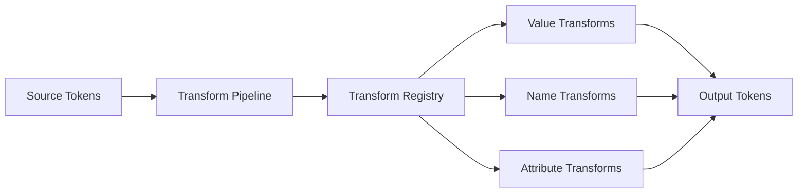

# Transform System Implementation

## Overview

The transform system provides a pipeline for modifying token values, names, and attributes during the build process. This enables platform-specific optimizations and format conversions while maintaining the source tokens unchanged.

## Architecture



## Core Interfaces

```typescript
interface Transform {
  name: string;
  type: 'value' | 'name' | 'attribute';
  matcher?: (token: Token, options?: TransformOptions) => boolean;
  transformer: (token: Token, context: TransformContext) => Token;
}

interface TransformContext {
  platform?: string;
  tokens: TokenDocument;
  options?: Record<string, unknown>;
  utils: TransformUtils;
}

interface TransformUtils {
  resolveReference: (path: string) => Token | undefined;
  getTokensByType: (type: string) => Token[];
  mathEvaluate: (expression: string) => number;
}
```

## Built-in Transforms

### Value Transforms

#### Dimension Transforms
```typescript
// px-to-rem
{
  name: 'dimension/px-to-rem',
  type: 'value',
  matcher: (token) => token.$type === 'dimension' && token.$value.endsWith('px'),
  transformer: (token, { options }) => ({
    ...token,
    $value: `${parseFloat(token.$value) / (options.baseFontSize || 16)}rem`
  })
}

// px-to-dp (Android)
{
  name: 'dimension/px-to-dp',
  type: 'value',
  matcher: (token) => token.$type === 'dimension',
  transformer: (token) => ({
    ...token,
    $value: `${parseFloat(token.$value)}dp`
  })
}

// px-to-pt (iOS)
{
  name: 'dimension/px-to-pt',
  type: 'value',
  matcher: (token) => token.$type === 'dimension',
  transformer: (token) => ({
    ...token,
    $value: parseFloat(token.$value) * 0.75
  })
}
```

#### Color Transforms
```typescript
// hex-to-rgb
{
  name: 'color/hex-to-rgb',
  type: 'value',
  matcher: (token) => token.$type === 'color' && token.$value.startsWith('#'),
  transformer: (token) => ({
    ...token,
    $value: hexToRgb(token.$value)
  })
}

// hex-to-hsl
{
  name: 'color/hex-to-hsl',
  type: 'value',
  matcher: (token) => token.$type === 'color',
  transformer: (token) => ({
    ...token,
    $value: hexToHsl(token.$value)
  })
}

// hex8-android
{
  name: 'color/hex8-android',
  type: 'value',
  matcher: (token) => token.$type === 'color',
  transformer: (token) => ({
    ...token,
    $value: toHex8Android(token.$value) // AARRGGBB format
  })
}

// UIColor (iOS)
{
  name: 'color/UIColor',
  type: 'value',
  matcher: (token) => token.$type === 'color',
  transformer: (token) => {
    const { r, g, b, a } = parseColor(token.$value);
    return {
      ...token,
      $value: `UIColor(red: ${r}, green: ${g}, blue: ${b}, alpha: ${a})`
    };
  }
}
```

#### Typography Transforms
```typescript
// compose-font-shorthand
{
  name: 'typography/shorthand',
  type: 'value',
  matcher: (token) => token.$type === 'typography',
  transformer: (token) => ({
    ...token,
    $value: `${token.$value.fontWeight} ${token.$value.fontSize}/${token.$value.lineHeight} ${token.$value.fontFamily}`
  })
}

// font-weight-to-number
{
  name: 'typography/weight-number',
  type: 'value',
  transformer: (token) => ({
    ...token,
    $value: {
      ...token.$value,
      fontWeight: fontWeightToNumber(token.$value.fontWeight)
    }
  })
}
```

### Name Transforms

```typescript
// camelCase
{
  name: 'name/camel',
  type: 'name',
  transformer: (token) => ({
    ...token,
    name: toCamelCase(token.name)
  })
}

// PascalCase
{
  name: 'name/pascal',
  type: 'name',
  transformer: (token) => ({
    ...token,
    name: toPascalCase(token.name)
  })
}

// kebab-case
{
  name: 'name/kebab',
  type: 'name',
  transformer: (token) => ({
    ...token,
    name: toKebabCase(token.name)
  })
}

// CONSTANT_CASE
{
  name: 'name/constant',
  type: 'name',
  transformer: (token) => ({
    ...token,
    name: toConstantCase(token.name)
  })
}

// snake_case
{
  name: 'name/snake',
  type: 'name',
  transformer: (token) => ({
    ...token,
    name: toSnakeCase(token.name)
  })
}
```

### Attribute Transforms

```typescript
// CTI (Category/Type/Item)
{
  name: 'attribute/cti',
  type: 'attribute',
  transformer: (token, { options }) => {
    const path = token.path || token.name;
    const segments = path.split('.');
    
    return {
      ...token,
      attributes: {
        ...token.attributes,
        category: segments[0],
        type: segments[1],
        item: segments.slice(2).join('-')
      }
    };
  }
}

// Type classification
{
  name: 'attribute/type-class',
  type: 'attribute',
  transformer: (token) => ({
    ...token,
    attributes: {
      ...token.attributes,
      typeClass: getTypeClass(token.$type) // 'color', 'size', 'typography', etc.
    }
  })
}

// Platform tags
{
  name: 'attribute/platform',
  type: 'attribute',
  transformer: (token, { platform }) => ({
    ...token,
    attributes: {
      ...token.attributes,
      platforms: [platform]
    }
  })
}
```

## Transform Pipeline

```typescript
class TransformPipeline {
  private registry: Map<string, Transform> = new Map();

  register(transform: Transform): void {
    this.registry.set(transform.name, transform);
  }

  execute(
    tokens: TokenDocument,
    transforms: string[],
    context: Partial<TransformContext> = {}
  ): TokenDocument {
    const fullContext: TransformContext = {
      tokens,
      platform: context.platform,
      options: context.options || {},
      utils: this.createUtils(tokens)
    };

    return transforms.reduce((acc, transformName) => {
      const transform = this.registry.get(transformName);
      if (!transform) {
        throw new Error(`Transform '${transformName}' not found`);
      }

      return this.applyTransform(acc, transform, fullContext);
    }, tokens);
  }

  private applyTransform(
    tokens: TokenDocument,
    transform: Transform,
    context: TransformContext
  ): TokenDocument {
    // Apply transform recursively to all tokens
    return mapTokens(tokens, (token) => {
      if (transform.matcher && !transform.matcher(token, context.options)) {
        return token;
      }
      return transform.transformer(token, context);
    });
  }
}
```

## Configuration

### Manifest Integration

```json
{
  "transforms": {
    "web": [
      "attribute/cti",
      "dimension/px-to-rem",
      "color/hex-to-rgb",
      "name/kebab"
    ],
    "ios": [
      "attribute/cti",
      "dimension/px-to-pt",
      "color/UIColor",
      "name/pascal"
    ],
    "android": [
      "attribute/cti",
      "dimension/px-to-dp",
      "color/hex8-android",
      "name/snake"
    ]
  },
  "platforms": {
    "web": {
      "transforms": ["web"],
      "formats": ["css", "scss"]
    },
    "ios": {
      "transforms": ["ios"],
      "formats": ["ios-swift"]
    }
  }
}
```

### CLI Usage

```bash
# Apply transforms
upft transform tokens.json --transforms "dimension/px-to-rem,color/hex-to-rgb" -o transformed.json

# Platform-specific transforms
upft transform tokens.json --platform web -o web-tokens.json
upft transform tokens.json --platform ios -o ios-tokens.json
```

### Programmatic API

```typescript
import { createTransformPipeline, builtInTransforms } from '@unpunnyfuns/tokens/transforms';

const pipeline = createTransformPipeline();

// Register built-in transforms
builtInTransforms.forEach(t => pipeline.register(t));

// Register custom transform
pipeline.register({
  name: 'custom/multiply',
  type: 'value',
  matcher: (token) => token.$type === 'dimension',
  transformer: (token, { options }) => ({
    ...token,
    $value: parseFloat(token.$value) * (options.multiplier || 1)
  })
});

// Execute pipeline
const transformed = pipeline.execute(
  tokens,
  ['dimension/px-to-rem', 'custom/multiply'],
  { 
    platform: 'web',
    options: { multiplier: 1.5 }
  }
);
```

## Custom Transforms

### Creating Custom Transforms

```typescript
import { Transform } from '@unpunnyfuns/tokens/transforms';

const myTransform: Transform = {
  name: 'my-org/custom-transform',
  type: 'value',
  matcher: (token) => {
    // Return true if this transform should apply
    return token.$type === 'color' && token.custom === true;
  },
  transformer: (token, context) => {
    // Modify and return the token
    return {
      ...token,
      $value: modifyValue(token.$value, context.options)
    };
  }
};
```

### Transform Composition

```typescript
// Compose multiple transforms
const compositeTransform: Transform = {
  name: 'composite/web-optimized',
  type: 'value',
  transformer: (token, context) => {
    let result = token;
    
    // Apply multiple transformations
    if (token.$type === 'dimension') {
      result = pxToRem(result, context);
    }
    if (token.$type === 'color') {
      result = optimizeColor(result, context);
    }
    
    return result;
  }
};
```

## Testing Strategy

```typescript
describe('Transform System', () => {
  it('should transform px to rem', () => {
    const input = { $value: '16px', $type: 'dimension' };
    const output = transforms['dimension/px-to-rem'].transformer(input, context);
    expect(output.$value).toBe('1rem');
  });

  it('should apply matcher correctly', () => {
    const token = { $value: '#FF0000', $type: 'color' };
    const shouldApply = transforms['color/hex-to-rgb'].matcher(token);
    expect(shouldApply).toBe(true);
  });

  it('should execute pipeline in order', () => {
    const pipeline = createTransformPipeline();
    const result = pipeline.execute(tokens, ['transform1', 'transform2']);
    expect(result).toMatchSnapshot();
  });
});
```

## Performance Considerations

1. **Lazy Evaluation**: Transforms only applied when needed
2. **Memoization**: Cache transform results for identical inputs
3. **Parallel Processing**: Apply independent transforms concurrently
4. **Streaming**: Process large token sets in chunks
5. **Optimization**: Pre-compile regex patterns and reuse

## Migration Path

```typescript
// Style Dictionary compatibility layer
function fromStyleDictionaryTransform(sdTransform): Transform {
  return {
    name: sdTransform.name,
    type: sdTransform.type,
    matcher: sdTransform.matcher,
    transformer: (token, context) => {
      const sdToken = toStyleDictionaryFormat(token);
      const result = sdTransform.transformer(sdToken);
      return fromStyleDictionaryFormat(result);
    }
  };
}
```

## Next Steps

1. Implement core transform registry
2. Build all standard transforms
3. Create transform testing suite
4. Add transform documentation
5. Build CLI commands
6. Create migration utilities