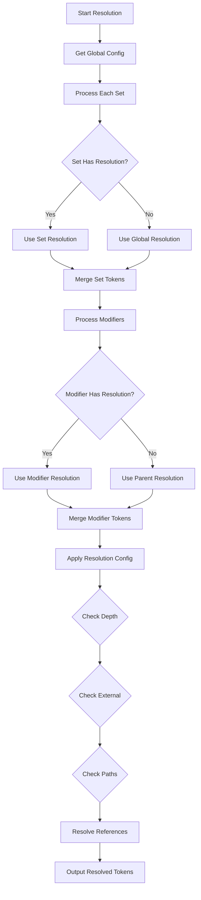

# Manifest Resolution Control

## Overview

Extension to the UPFT manifest specification to control how references (`$ref` and `{alias}`) are resolved during token processing, with per-set and per-modifier granularity.

## Problem Statement

Currently, reference resolution happens automatically after manifest merging with no user control over:
- How deep to resolve reference chains
- Whether to follow external `$ref` files
- Security boundaries for file access
- Performance limits for resolution
- How to handle circular references
- Different resolution needs for different token sets

## Proposed Solution

Add `resolution` configuration at multiple levels:
1. Global manifest level (default for all)
2. Per-set level (override for specific sets)
3. Per-modifier level (override for specific modifier values)

## Schema

```typescript
interface ManifestWithResolution extends UPFTResolverManifest {
  // Global resolution config (applies to all unless overridden)
  resolution?: ResolutionConfig;
  
  // Sets with optional resolution override
  sets?: Array<{
    values: string[];
    resolution?: ResolutionConfig;  // Override for this set
  }>;
  
  // Modifiers with optional resolution per value
  modifiers?: Record<string, {
    oneOf?: string[];
    anyOf?: string[];
    values?: Record<string, {
      files: string[];
      resolution?: ResolutionConfig;  // Override for this modifier value
    }>;
  }>;
}

interface ResolutionConfig {
  /**
   * How deep to resolve references
   * - "none": Don't resolve any references
   * - "shallow": Resolve only direct references (1 level)
   * - "full": Resolve all references recursively (default)
   * - number: Resolve up to N levels deep
   */
  depth?: "none" | "shallow" | "full" | number;
  
  /**
   * Whether to follow external $ref references
   * Default: true
   */
  external?: boolean;
  
  /**
   * How to handle external references that bring in objects
   * - "merge": Merge with existing values (default)
   * - "replace": Replace existing values completely
   */
  strategy?: "merge" | "replace";
  
  /**
   * Whether to allow circular references
   * Default: false (throws error on cycles)
   */
  allowCycles?: boolean;
  
  /**
   * Maximum time in milliseconds for resolution
   * Default: 30000 (30 seconds)
   */
  timeout?: number;
  
  /**
   * Allowed paths for external references (glob patterns)
   */
  allowedPaths?: string[];
  
  /**
   * Blocked paths for external references (glob patterns)
   */
  blockedPaths?: string[];
  
  /**
   * Which reference types to resolve
   */
  types?: {
    jsonRef?: boolean;    // $ref references (default: true)
    dtcgAlias?: boolean;  // {alias} references (default: true)
  };
}
```

## Configuration Examples

### Global with Per-Set Override

```json
{
  "resolution": {
    "depth": "full",
    "external": true
  },
  "sets": [
    {
      "values": ["tokens/core.json"],
      "resolution": {
        "depth": "none"  // Core tokens stay unresolved
      }
    },
    {
      "values": ["tokens/semantic.json"]
      // Uses global resolution config
    }
  ]
}
```

### Per-Modifier Resolution

```json
{
  "resolution": {
    "depth": "full"
  },
  "modifiers": {
    "theme": {
      "oneOf": ["light", "dark"],
      "values": {
        "light": {
          "files": ["tokens/theme-light.json"],
          "resolution": {
            "depth": "full",
            "external": true  // Light theme can use external refs
          }
        },
        "dark": {
          "files": ["tokens/theme-dark.json"],
          "resolution": {
            "depth": "shallow",
            "external": false  // Dark theme is more restricted
          }
        }
      }
    },
    "brand": {
      "oneOf": ["main", "sub"],
      "values": {
        "main": {
          "files": ["tokens/brand-main.json"]
          // Uses global resolution
        },
        "sub": {
          "files": ["tokens/brand-sub.json"],
          "resolution": {
            "depth": "none"  // Sub-brand tokens stay as references
          }
        }
      }
    }
  }
}
```

### Complex Example: Different Strategies per Context

```json
{
  "resolution": {
    "depth": "full",
    "external": false,
    "strategy": "merge"
  },
  "sets": [
    {
      "values": ["tokens/base/**/*.json"],
      "resolution": {
        "depth": "full",
        "external": true,
        "allowedPaths": ["./tokens/shared/**"]
      }
    },
    {
      "values": ["tokens/components/**/*.json"],
      "resolution": {
        "depth": 2,  // Limit depth for performance
        "external": false
      }
    }
  ],
  "modifiers": {
    "platform": {
      "oneOf": ["web", "ios", "android"],
      "values": {
        "web": {
          "files": ["tokens/platforms/web.json"],
          "resolution": {
            "depth": "full",
            "types": {
              "jsonRef": true,
              "dtcgAlias": true
            }
          }
        },
        "ios": {
          "files": ["tokens/platforms/ios.json"],
          "resolution": {
            "depth": "shallow",  // iOS tools handle deep resolution
            "types": {
              "jsonRef": true,
              "dtcgAlias": false  // iOS doesn't understand DTCG aliases
            }
          }
        },
        "android": {
          "files": ["tokens/platforms/android.json"],
          "resolution": {
            "depth": "none"  // Android build tools handle all resolution
          }
        }
      }
    }
  }
}
```

## Use Cases

### Development vs Production

```json
{
  "modifiers": {
    "env": {
      "oneOf": ["dev", "prod"],
      "values": {
        "dev": {
          "files": ["tokens/env-dev.json"],
          "resolution": {
            "depth": "full",
            "external": true,
            "allowCycles": true,  // Allow for debugging
            "timeout": 60000
          }
        },
        "prod": {
          "files": ["tokens/env-prod.json"],
          "resolution": {
            "depth": "full",
            "external": false,  // Security: no external refs in prod
            "allowCycles": false,
            "timeout": 10000,
            "blockedPaths": ["**/node_modules/**", "**/.*"]
          }
        }
      }
    }
  }
}
```

### Performance Optimization

```json
{
  "sets": [
    {
      "values": ["tokens/critical.json"],
      "resolution": {
        "depth": "full"  // Fully resolve critical tokens
      }
    },
    {
      "values": ["tokens/optional.json"],
      "resolution": {
        "depth": 1,  // Shallow resolution for optional tokens
        "timeout": 1000  // Quick timeout
      }
    }
  ]
}
```

### Security Boundaries

```json
{
  "modifiers": {
    "customer": {
      "anyOf": ["acme", "globex", "umbrella"],
      "values": {
        "acme": {
          "files": ["customers/acme/tokens.json"],
          "resolution": {
            "external": true,
            "allowedPaths": ["./customers/acme/**"],  // Sandbox to customer dir
            "blockedPaths": ["./customers/globex/**", "./customers/umbrella/**"]
          }
        },
        "globex": {
          "files": ["customers/globex/tokens.json"],
          "resolution": {
            "external": true,
            "allowedPaths": ["./customers/globex/**"],
            "blockedPaths": ["./customers/acme/**", "./customers/umbrella/**"]
          }
        }
      }
    }
  }
}
```

## Resolution Process



## Implementation

### Resolution Hierarchy

```typescript
class ResolutionHierarchy {
  constructor(
    private global?: ResolutionConfig,
    private perSet: Map<string, ResolutionConfig> = new Map(),
    private perModifier: Map<string, ResolutionConfig> = new Map()
  ) {}
  
  getConfigForSet(setId: string): ResolutionConfig {
    return this.perSet.get(setId) || this.global || DEFAULT_CONFIG;
  }
  
  getConfigForModifier(modifierKey: string): ResolutionConfig {
    return this.perModifier.get(modifierKey) || this.global || DEFAULT_CONFIG;
  }
  
  mergeConfigs(...configs: (ResolutionConfig | undefined)[]): ResolutionConfig {
    // Later configs override earlier ones
    return configs.reduce((merged, config) => ({
      ...merged,
      ...config
    }), {} as ResolutionConfig);
  }
}
```

### Per-Set Resolution

```typescript
async function resolveSet(
  set: Set,
  tokens: TokenDocument,
  hierarchy: ResolutionHierarchy
): Promise<TokenDocument> {
  const config = set.resolution || hierarchy.getConfigForSet(set.id);
  const resolver = new ResolutionController(config);
  return resolver.resolve(tokens);
}
```

### Per-Modifier Resolution

```typescript
async function resolveModifier(
  modifierKey: string,
  modifierValue: string,
  tokens: TokenDocument,
  manifest: ManifestWithResolution
): Promise<TokenDocument> {
  const modifierConfig = manifest.modifiers?.[modifierKey]?.values?.[modifierValue]?.resolution;
  const config = modifierConfig || manifest.resolution || DEFAULT_CONFIG;
  
  const resolver = new ResolutionController(config);
  return resolver.resolve(tokens);
}
```

## Benefits

1. **Granular Control**: Different resolution strategies for different token sets
2. **Performance**: Optimize resolution per set based on needs
3. **Security**: Different security boundaries for different contexts
4. **Flexibility**: Mix resolved and unresolved tokens as needed
5. **Platform-Specific**: Handle platform requirements differently
6. **Environment-Aware**: Different configs for dev vs production

## Testing

```typescript
describe('Hierarchical Resolution', () => {
  it('applies set-level resolution override', async () => {
    const manifest = {
      resolution: { depth: 'full' },
      sets: [{
        values: ['tokens.json'],
        resolution: { depth: 'none' }
      }]
    };
    
    const result = await resolve(manifest);
    expect(hasUnresolvedRefs(result)).toBe(true);
  });
  
  it('applies modifier-level resolution override', async () => {
    const manifest = {
      resolution: { depth: 'full' },
      modifiers: {
        theme: {
          values: {
            light: {
              files: ['light.json'],
              resolution: { external: false }
            }
          }
        }
      }
    };
    
    const result = await resolve(manifest, { theme: 'light' });
    // Should fail if light.json has external refs
  });
});
```

## Migration Path

Backward compatible - if no resolution config specified at any level, defaults to current behavior (full resolution).

## Open Questions

1. Should resolution configs be composable (inherit + override)?
2. Should we support resolution profiles that can be referenced?
3. How to handle conflicts when merging tokens with different resolution depths?
4. Should resolution config affect the merge order?