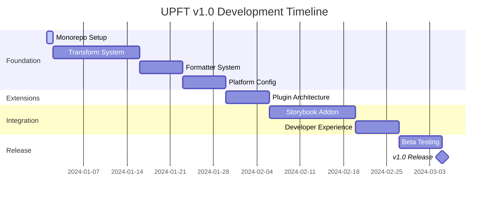

# UPFT Roadmap

## Vision

Transform UPFT into the industry-leading design token platform by achieving feature parity with competitors while maintaining our core strengths in type safety, DTCG compliance, and functional architecture.

## Current State (v0.5.0)

UPFT is a production-ready design token platform with:
- ✅ Full DTCG compliance
- ✅ Type-safe token operations
- ✅ Multi-dimensional composition
- ✅ Comprehensive validation
- ✅ Built-in linting (21 rules)
- ✅ AST-based operations
- ✅ Reference resolution with cycle detection

## Target State (v1.0.0)

### Core Objectives

1. **Output Format Parity**: Match Style Dictionary/Terrazzo capabilities
2. **Transform System**: Comprehensive value and name transformations
3. **Plugin Architecture**: Enable community extensions
4. **Storybook Integration**: Best-in-class token documentation
5. **Platform Support**: iOS, Android, Web, React Native outputs
6. **Developer Experience**: Visual tools and IDE integrations

## Roadmap Overview

### Phase 0: Monorepo Architecture (Week 0)
Convert to monorepo structure for modular development and independent versioning.
[→ Details](./00-monorepo-architecture.md)

### Phase 1: Transform System (Weeks 1-2)
Build comprehensive transform infrastructure for value conversions and name transformations.
[→ Details](./01-transform-system.md)

### Phase 2: Formatter System (Weeks 2-3)
Implement multi-format output generators for all major platforms.
[→ Details](./02-formatter-system.md)

### Phase 3: Platform Configuration (Week 3)
Enable platform-specific build configurations and optimizations.
[→ Details](./03-platform-configuration.md)

### Phase 4: Plugin Architecture (Week 4)
Create extensible plugin system for community contributions.
[→ Details](./04-plugin-architecture.md)

### Phase 5: Storybook Addon (Weeks 5-6)
Develop comprehensive Storybook addon for token documentation.
[→ Details](./05-storybook-addon.md)

### Phase 6: Developer Experience (Week 7)
Enhance tooling with dev server, IDE extensions, and integrations.
[→ Details](./06-developer-experience.md)

## Success Metrics

| Metric | Current | Target |
|--------|---------|--------|
| Output Formats | 3 (JSON/YAML/JSON5) | 10+ (CSS, SCSS, iOS, Android, etc.) |
| Built-in Transforms | 0 | 20+ |
| Plugin Support | ❌ | ✅ |
| Storybook Addon | ❌ | ✅ |
| Visual Tools | ❌ | ✅ |
| Platform Configs | ❌ | ✅ |

## Implementation Strategy

1. **Maintain Backwards Compatibility**: All new features are additive
2. **Incremental Releases**: Ship features as they're completed
3. **Community Feedback**: Beta releases for early adopters
4. **Documentation First**: Comprehensive docs for all features
5. **Test Coverage**: Maintain >90% test coverage

## Timeline

## Resources

- [Competitive Analysis](./competitive-analysis.md)
- [Migration Guide](./migration-guide.md)
- [Implementation Timeline](./implementation-timeline.md)

## Contributing

We welcome community input on this roadmap. Please:
1. Review the detailed specifications
2. Open issues for discussion
3. Submit PRs for implementation
4. Join our Discord for real-time collaboration

## Next Steps

1. Review and refine specifications
2. Set up monorepo structure (Phase 0)
3. Begin Phase 1 implementation
4. Establish beta testing program
5. Create community communication channels